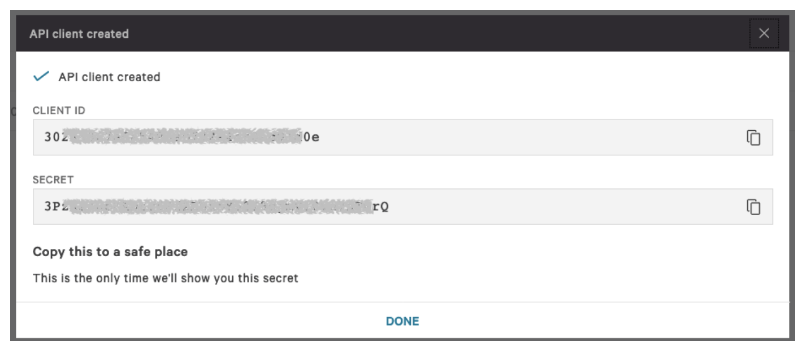

# Implementation Guide 

## CrowdStrike Cloud Security Posture with AWS Control Tower

This template will setup CrowdStrike Horizon and Discover with your AWS Organiszation managed by Control Tower.

# Foreword

### Horizon
Horizon connects to your Public cloud accounts, assesses your cloud settings, and analyzes the findings to identify potential misconfigurations that can lead to security risks.
Horizon assesses your cloud configurations continuously and compares your settings to its policies. Using the information from those assessments, Horizon produces a cloud security posture-based dashboard and reports.

### Discover
Just as Falcon Discover keeps you informed about the status of your hosts, Cloud Workloads Discovery improves your IT hygiene by helping you stay informed about Elastic Compute Cloud (EC2) instances in your Amazon Web Services (AWS) environment. You can use Cloud Workloads Discovery to:

 * View information about your EC2 instances

* Catalog metadata on your EC2 instances

* Learn about EC2 instances even if they don't have a Falcon sensor

# Pre-requisites
Customers will require the following:
*Subscription to Falcon Horizon* **or** *Falcon Cloud Workload Protection Bundle*.

# Deployment Configuration Steps

## Setup
Perform the tasks below to enable Control Tower to automatically register your account with CrowdStrike CSPM (Horizon).

1) Generate CrowdStrike Falcon API Keys.

    First login to the CrowdStrike console and go to [Support --> API Clients and Keys](https://falcon.crowdstrike.com/cloud-security/registration/en-US/app/cspm/cspm_accounts). Obtain CrowdStrike OAuth2 keys from the Falcon Console. Copy the ``CLIENT ID`` and ``SECRET`` as these will be used in the template.
   
    
   
    
2) Download the code from [https://github.com/CrowdStrike/Cloud-AWS](https://github.com/CrowdStrike/Cloud-AWS).

    The GitHub repository contains a folder "Control-Tower-For-Horizon":

    * Select the template ``Falcon_Horizon_Control_Tower.yaml`` from the *Control-Tower-For-Horizon/cloudformation* folder.

3) Load the CloudFormation template in the 'master' account

   Login to your Control Tower ``master`` account and apply the CloudFormation template "*Falcon_Horizon_Control_Tower.yaml*".

    Fill in the missing parameter values 

| Parameter             | Description |
| ----------------------- | -------- |
| FalconClientID        | Falcon API Key Client ID         |
| FalconSecret          | Falcon API Key Secret          || 
| CSCloud               | CrowdStrike Cloud (us1, us-2 or eu-1)   | 
| EnableIOA             | Enable IOA Scanning (Adds EventBridge forwarding Rules) |                            
| UseExistingCloudtrail | Disables Cloudtrail forwarding (No recon activity associated with attack)    |
| QSS3BucketName        | Quick Start S3 Bucket Name (Do not change unless you are modifying the template and staging your own files)  |
| QSS3BucketRegion      | Quick Start S3 bucket region (Do not change unless you are modifying the template and staging your own files) |
| S3KeyPrefix           | Quick Start S3 Key Prefix (Do not change unless you are modifying the template and staging your own files)   |
| CTAdminRoleName       | Control Tower StackSet adminisistration Rolename (Do not change unless using custom role names)              | 
| CTExecutionRoleArn    | Control Tower StackSet Execution Rolename   (Do not change unless using custom role names)                   | 

   The CloudFormation template will create the following resources in the account:

   CrowdStrike-CSPM-Integration

* StackSet *CrowdStrike-CSPM-Integration* that will be applied to all new accounts.

* Stack  *CrowdStrike-CSPM-Integration* that is applied to the master account
  
* CloudWatch rule to trigger a lambda function.

* Lambda function triggered by CloudWatch to push the StackSet to a new account (manage_account_lifecycle.py)

# Account Creation Workflow

The account creation process consists of the following steps

1) The Customer creates a new account through one of three methods

    https://docs.aws.amazon.com/controltower/latest/userguide/account-factory.html
    
    * Through the Account Factory console that is part of AWS Service Catalog.

    * Through the 'Enroll' account feature within AWS Control Tower.

    * From the AWS Control Tower landing zone's management account, using Lambda code and appropriate IAM roles.
    

2) Account Factory begins the account creation process.

  
3) The account creation process generates a  *CreateManagedAccount* event notification in CloudWatch. Reference the AWS documentation at https://docs.aws.amazon.com/controltower/latest/userguide/lifecycle-events.html#createmanaged-account.

4) A CloudWatch event rule triggers a Lambda function (managed_account_lifecycle.py).   

5) The Lambda creates a stackset instance from *CrowdStrike-CSPM-Integration* Stackset in the new account.
   

7) The StackSet instance creates an IAM role and lambda function. The lambda function creates an eventbridge forwarding rule in each region in the account if IOA scanning is enabled. 
   

8) Once the IAM Role is created the Horizon service will use this role to discover assets in the account.
    
    The IAM is setup with a trust policy that includes an externalID generated by the CrowdStrike account registration API.
   
    How to Use an External ID When Granting Access to Your AWS Resources to a Third Party:
    [https://docs.aws.amazon.com/IAM/latest/UserGuide/id_roles_create_for-user_externalid.html](https://docs.aws.amazon.com/IAM/latest/UserGuide/id_roles_create_for-user_externalid.html)

   
